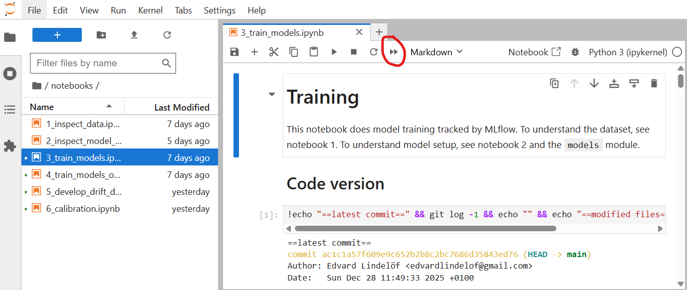
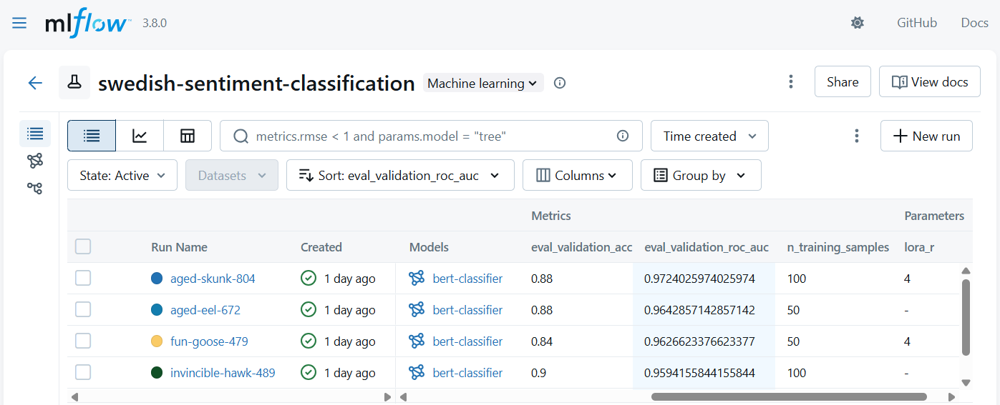
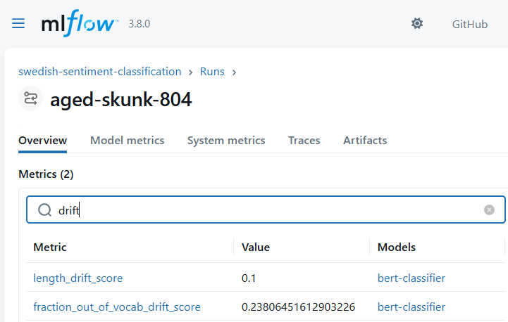
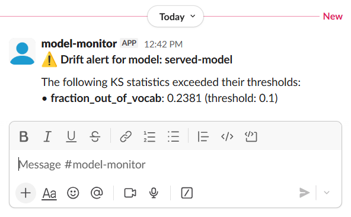

# Machine learning model deployment starter
A starter project for developing, training, deploying and monitoring prediction models.

Key technologies involved are MLflow, Hugging Face Transformers, DVC and Jupyter.
With services containerized and storage delegated to S3 and SQL, the solution is readily transferable to the cloud.

## Purpose
This is intended as a starter-setup for developing and deploying AI/ML models in a sound way.
For the case that a small ML team look to engineer their own datasets to deploy a small number of prediction models for use by a small number of consumers, it is a reasonably production-ready setup.

Content:
- **models/**: a Python package for code used by both services and experimentation notebooks
  - training code for BERT-based classifiers
  - code for monitoring data drift
- **services/** (and docker-compose.yaml): containerized services
  - MLflow set up with S3
  - prediction service hosting a deployed model
  - simplistic monitoring service
  - proof-of-concept web app invoking a deployed model
- **notebooks/**: sample model experimentation integrated with services and code package
  - tracked training of a BERT-based classifier for swedish sentiment classification
  - development of data drift detection
  - adhoc calibration analysis of deployed model
- **.dvc/** (and data/): DVC setup
  - synced with S3 and Git
  - containing a small example (200 texts) of iteratively simulated, versioned data

## Setup
These are the tool installation steps for Ubuntu:
- uv:
  ```bash
  curl -LsSf https://astral.sh/uv/install.sh | sh
  ```
- direnv:
  ```bash
  sudo apt install direnv
  echo 'eval "$(direnv hook bash)"' >> ~/.bashrc
  ```
- Docker: [Get Docker](https://docs.docker.com/get-started/get-docker/)
- docker compose:
  ```bash
  sudo apt install docker-compose-plugin
  ```
- DVC:
  ```bash
  uv tool install dvc[s3]
  ```

Configure environment variables:
```bash
cp .env.local .env
direnv allow
```
Everything in the next section except the Slack notification will work using the placeholder values from .env.local.

## Trying it out

### 1. Start experiment tracking services
```bash
docker compose --profile tracking up -d
```

This should start MLflow [here](http://localhost:5000/) and MinIO S3 storage [here](http://localhost:9001/). Username and password are both "predadmin".

### 2. Set up DVC and sync it with Git and MinIO
```bash
dvc install
tar -xzf .dvc/cache-snapshots/40e8d89e10917cf83733f75b32e2694d12f604b5.tar.gz
dvc checkout
dvc push
```
You should now be able to jump between versions of data by `git checkout`ing data history commits shown by `git log data/*.dvc`.

### 3. Run training and analysis
To run training and other analyses, first start Jupyter:
```bash
uv run jupyter lab
```
You can train two models for sentiment classification of swedish sentences by re-running notebooks/3_train_models.ipynb:



Training artifacts, parameters and scores for trained models can then be viewed [here](http://localhost:5000/#/experiments/1/runs):



To choose a model for making available to the prediction service, navigate to it, press Register model and register under one called "served-model".

### 4. Serve the registered model
To deploy the classifier registered as "served-model", start the prediction services:
```bash
docker compose --profile serving up -d
```

You can now open the proof-of-concept web app [here](http://localhost:8000/) to get a live prediction:


### 5. Start monitoring service
```bash
docker compose --profile monitoring up -d
```
The monitoring service runs a drift detection method, identified in notebooks/5_develop_drift_detection.ipynb, every 7 days.

Drift statistics are stored under the model in MLflow (in a way that will later be plottable over time):



And a notification is sent to Slack if any drift statistic threshold is exceeded:



Slack was set up by
1. registering an app [here](https://api.slack.com/apps/)
2. creating a Bot User Oauth for it under OAuth & Permissions
3. mentioning the bot with @ in a Slack channel to invite it
4. replacing the placeholder values in .env with the token and channel ID

## Version controlling data
- install with `dvc install`
- store data in data/
- track added and changed files with `dvc add data/<the file>`
- pull/push changes from/to the MinIO service with `dvc pull` and `dvc push`
- the copy of the files in data/ are automatically kept in sync with the checked out git commit through pre-commit hooks

## Moving to the cloud
The setup can be moved to the Cloud by, for example,
- running MLflow, prediction service and the web app containers with Google Cloud run
- replacing MinIO with Google Cloud Storage
- replacing the local postgres and sqlite servers with Google Cloud SQL for PostgreSQL
- scheduling the monitoring container with Google Cloud Scheduler
